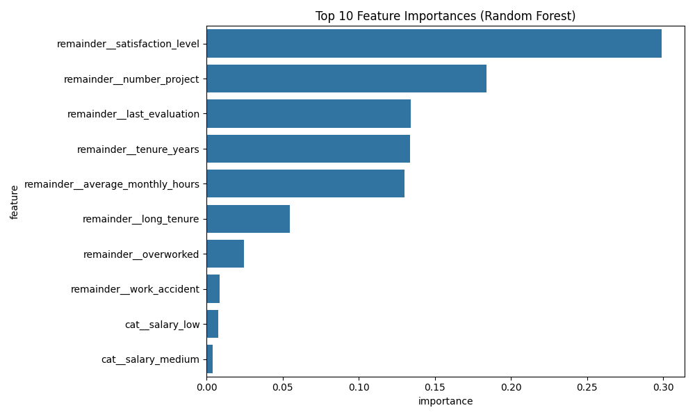

# Salifort Motors Employee Retention Analysis

## Overview

This project analyses employee attrition at Salifort Motors using exploratory data analysis and machine learning models.

The goal is to identify key drivers of employee turnover and provide actionable recommendations to improve retention.

---

## What is Employee Attrition?

Employee attrition refers to employees leaving an organisation. Understanding its drivers helps companies reduce costs, improve retention, and maintain workforce stability.

---

## Business Problem

Employee turnover can lead to increased costs, reduced productivity, and disruption to teams.

This project aims to:

- Identify factors contributing to employee attrition
- Predict which employees are likely to leave
- Provide data-driven recommendations to improve retention

---

## Tools & Technologies

- Python
- Jupyter Notebook
- pandas
- numpy
- matplotlib
- seaborn
- scikit-learn

---

## Project Workflow

1. **Data Cleaning**
2. **Exploratory Data Analysis (EDA)**
3. **Feature Engineering**
4. **Modelling (Logistic Regression, Decision Tree, Random Forest)**
5. **Model Evaluation and Interpretation**

---

## Key Findings

- Employees working longer hours are more likely to leave
- Higher project load is associated with increased attrition
- Lower salary levels correlate with higher turnover
- Employee satisfaction is a strong predictor of retention

---

## Model Performance

- **Logistic Regression:** ~81% accuracy (limited ability to detect leavers)
- **Decision Tree:** ~97.5% accuracy
- **Random Forest:** ~99.0% accuracy (best performing model)

---

## Feature Importance

The Random Forest model identified the most important drivers of employee attrition, with satisfaction, workload, and project count emerging as major predictors.



---

## Model Evaluation

The confusion matrix shows how effectively the Random Forest model distinguishes between employees who stay and employees who leave.


---

## Business Recommendations

- Monitor employee workload to reduce burnout risk
- Identify high-risk employees early using predictive models
- Review compensation structures
- Improve employee satisfaction and engagement

---

## View the Project

- [Jupyter Notebook](notebooks/salifort_motors_employee_retention.ipynb)
- [HTML Report](notebooks/salifort_motors_employee_retention.html)

---

## How to Run

```bash
pip install -r requirements.txt
jupyter notebook
